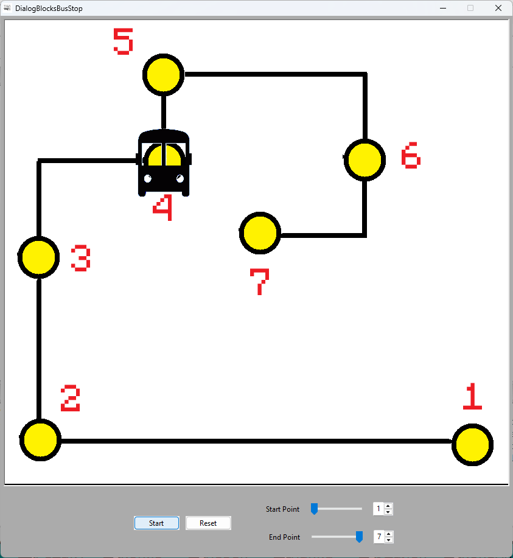

# DialogBlocksBusStop
Работа с таймерами на примере визуальной программы на C++ с использованием wxWidgets и DialogBlocks

## Ссылки:

http://www.anthemion.co.uk/dialogblocks/

https://www.wxwidgets.org/

http://www.anthemion.co.uk/dialogblocks/ImageBlocks-1.07-Setup.exe
